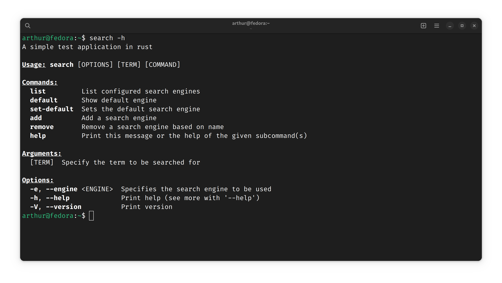

# Terminal Search

This project was created with the aim of solving a simple problem,
but persistent in my daily life: frequent searches. The extent to which it takes place
the activities of a programmer, certain distinct, unknown terms
-- frequent or not --, appear.

In order to extinguish the monotonous process of copying the term, open the browser
in your favorite search engine, it would be very convenient to simply select
and activate a key combination. With this in mind, this project was created.

~~Is it a silly thing? Probably, but this was created just for me to expand my Rust skills~~

## Summary

- Configuration;
- Usage;

## Configuration

For the program to work, all you need to do is download the executable, place it in a location
of your choice and, if you wish - for ease of use - add it to your
environment variable. You can also create a keyboard shortcut for the executable in order to
run it by the following command:

```bash
./search
```

## Usage



### Explanation

#### Commands
- The **list** command will list the search engines configured in the **.search_config.yaml** file located on your
home directory under folder **.search**.
- **default** will show the default search engine defined in the **~/.search_config.yaml** file;
- **set-default** will set the default search engine based on the name passed as an argument;
- **add** will add a new search engine based on the values passed as an argument, they are:
  - **NAME**, name of the search engine;
  - **URL_PATTERN**, the search engine URL pattern;
  - **PATTERN**, the pattern that should be replaced in **URL_PATTERN**;
  - **REGEX**, the regex that will be applied to the string before the replacement is made;
  - **REPLACEMENT**, the value by which the regex will be replaced in the search term;

  ```bash
  search add google https://www.google.com/search?q={{term}} {{term}} \\s+ +
  ```  
  
This will add the Google search engine with the url pattern `https://www.google.com/search?q={{term}}` and when you
call the executable to use this search engine, it will replace `{{term}}` with the search term applying the
regex `\s+` and replacing the matches with `+`, that is, 'sla something' becomes 'sla+something' before
to be replaced in the url pattern. 

- **remove**, removes a search engine based on name or in your uuid, if the `--uuid` flag is passed;

#### Argument
- **TERM** the search term;

#### Flags
- **--engine** specifies the search engine to be used based on the name;

## Solving problems

If you have any problems, open an issue posting the last lines of **~/.search.log**;

## Future changes

- [x] Subcommand to edit configuration file;
- [x] Using journal;
- [ ] Increased fault tolerance;
- [ ] Verification of manual editing in the configuration file, creation of correction and validation suggestions;
- [ ] Incognito mode;